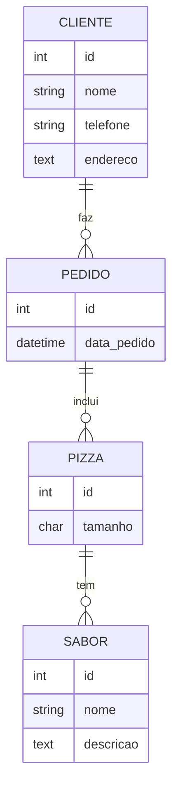

```mermaid
erDiagram
    CLIENTE ||--o{ PEDIDO : faz
    PEDIDO ||--o{ PIZZA : inclui
    PIZZA ||--o{ SABOR : tem

    CLIENTE {
        int id
        string nome
        string telefone
        text endereco
    }

    SABOR {
        int id
        string nome
        text descricao
    }

    PIZZA {
        int id
        char tamanho
    }

    PEDIDO {
        int id
        datetime data_pedido
    }
```